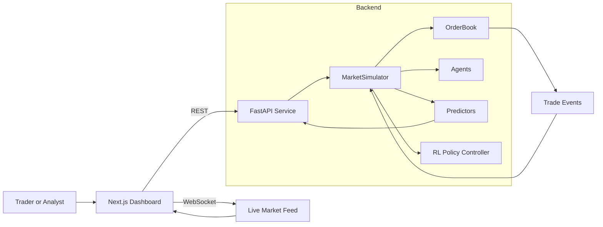

# SENTINEL Architecture

## 1. Overview
SENTINEL is a real-time market microstructure simulator with a FastAPI backend and a Next.js dashboard. The backend runs a multi-agent limit order book simulation, produces liquidity and large-order signals, and streams updates over WebSocket. The frontend subscribes to the live feed and renders the dashboard panels.

## 2. High-Level Component Map

## 3. Backend Architecture
### 3.1 API Layer
- REST endpoints for simulation control, snapshots, and predictions.
- WebSocket endpoint for real-time market updates.
- CORS configuration is derived from environment variables.

### 3.2 Simulation Core
- Event-driven kernel schedules agent wakeups and order arrivals.
- Limit order book provides price-time matching and depth aggregates.
- Simulator maintains price history, volume history, and state snapshots.

### 3.3 Agents
- Base agent manages positions, PnL, active orders, and metrics.
- Specialized agents (market maker, HFT, institutional, retail, informed, noise, sentiment, spoofing, momentum, mean reversion, RL) implement strategy-specific order logic.

### 3.4 Predictors
- Liquidity shock predictor computes a health score and warning level from market state features.
- Large-order detector flags iceberg or TWAP patterns based on order flow statistics.

### 3.5 RL Integration
- Optional RL policy controller loads a trained PPO agent if available.
- RL policy can adjust market maker actions during simulation steps.

## 4. Frontend Architecture
- Next.js app serves the dashboard route and UI layout.
- Zustand store holds live market state and connection status.
- WebSocket hook buffers the latest market update and flushes it on a timer.
- Panels render price, depth, liquidity, large-order detection, and agent metrics.

## 5. Data Flow Details
### 5.1 Simulation Loop
1. API receives start request and initializes agents and simulator.
2. Event kernel schedules wakeups and order arrivals based on agent latency.
3. OrderBook matches orders, emits trades, updates price history.
4. Simulator computes market state, predictions, and agent metrics.
5. API broadcasts an update packet via WebSocket.

### 5.2 REST Read Model
- Snapshot and prediction endpoints query the in-memory simulator state.
- Health endpoint reports backend connectivity, mode, and RL readiness.

## 6. State and Deployment Notes
- Simulator state is in-memory; running multiple backend replicas requires externalized state or sharding.
- WebSocket streaming relies on a long-running backend process.
- Docker Compose runs backend and frontend locally.

## 7. Configuration
Key environment variables (backend):
- SIMULATION_DURATION
- INITIAL_PRICE
- RL_POLICY_ENABLED
- RL_MODEL_PATH
- FRONTEND_URL
- ALLOWED_ORIGINS

Key environment variables (frontend):
- NEXT_PUBLIC_API_URL
- NEXT_PUBLIC_WS_URL
